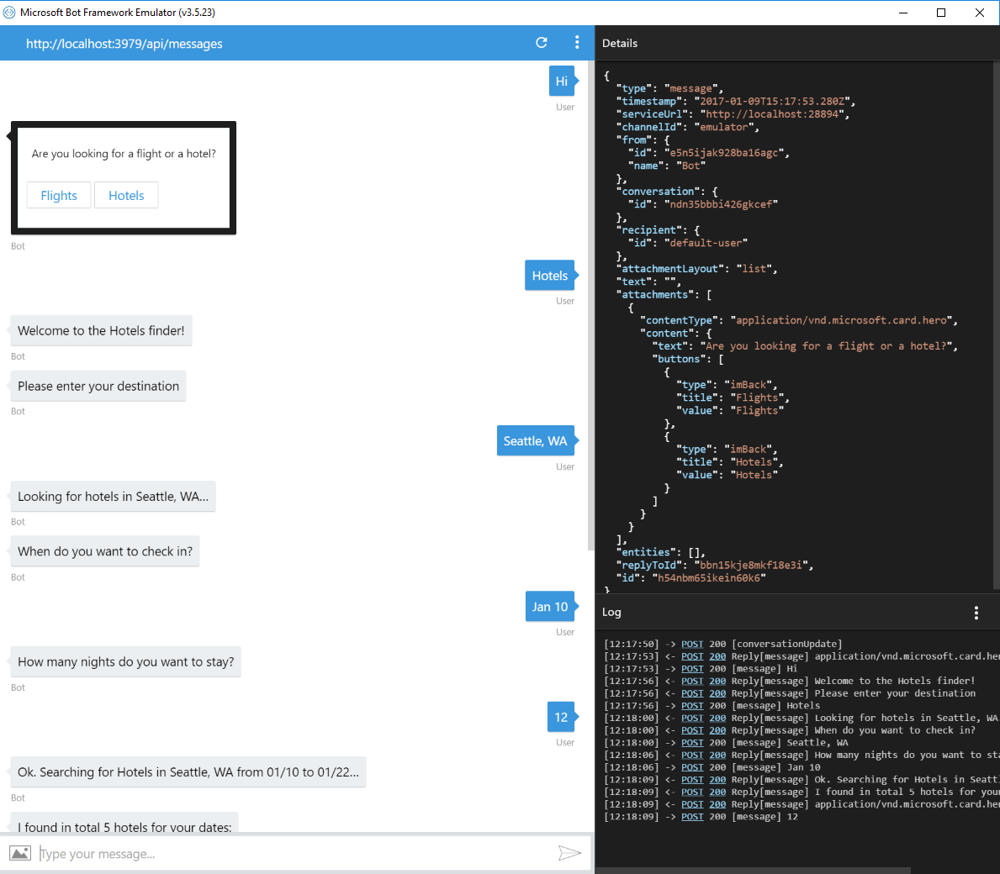
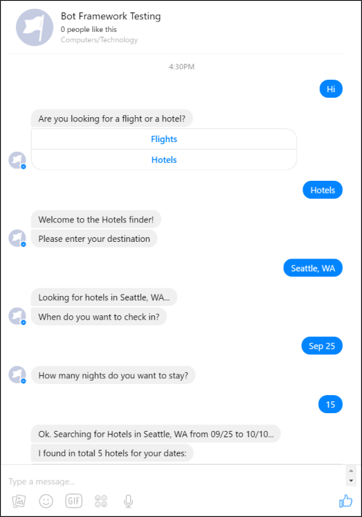
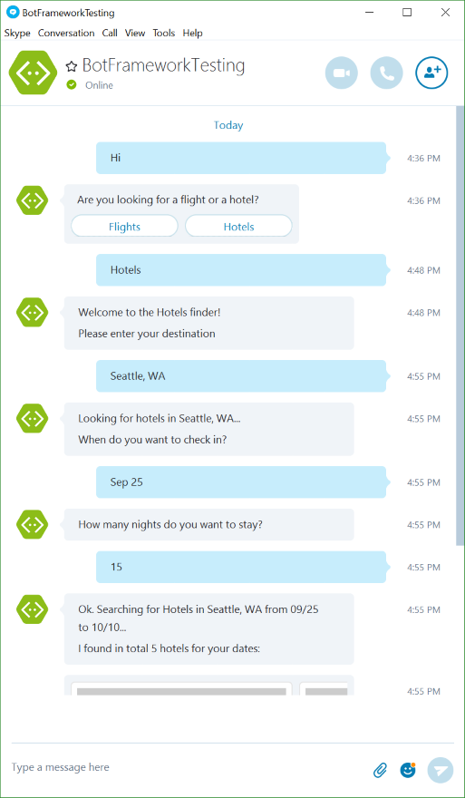

# Hotel Finder Bot using Cortana Sample

A hotel finder bot that connects to Cortana. 

[![Deploy to Azure][Deploy Button]][Deploy Node/HotelFinder]

[Deploy Button]: https://azuredeploy.net/deploybutton.png
[Deploy Node/MultiDialogs]: https://azuredeploy.net

### Prerequisites

The minimum prerequisites to run this sample are:
* Latest Node.js with NPM. Download it from [here](https://nodejs.org/en/download/).
* The Bot Framework Emulator. To install the Bot Framework Emulator, download it from [here](https://emulator.botframework.com/). Please refer to [this documentation article](https://github.com/microsoft/botframework-emulator/wiki/Getting-Started) to know more about the Bot Framework Emulator.
* **[Recommended]** Visual Studio Code for IntelliSense and debugging, download it from [here](https://code.visualstudio.com/) for free.

### Outcome

You will see the following result in the Bot Framework Emulator when opening and running the sample solution.

You will see the following in your Facebook Messenger.

On the other hand, you will see the following in Skype.

### More Information

To get more information about how to get started in Bot Builder for Node and Dialogs please review the following resources:
* [Bot Builder for Node.js Reference](https://docs.microsoft.com/en-us/bot-framework/nodejs/)
* [Dialogs](https://docs.microsoft.com/en-us/bot-framework/nodejs/bot-builder-nodejs-dialog-manage-conversation)
* [Dialog Stack](https://docs.microsoft.com/en-us/bot-framework/nodejs/bot-builder-nodejs-dialog-manage-conversation#dialog-stack)
* [Prompt users for input](https://docs.microsoft.com/en-us/bot-framework/nodejs/bot-builder-nodejs-dialog-prompt)
* [Starting and ending dialogs] (https://docs.microsoft.com/en-us/bot-framework/nodejs/bot-builder-nodejs-dialog-manage-conversation#starting-and-ending-dialogs)
* [Using Session in Callbacks](https://docs.botframework.com/en-us/node/builder/chat/session/#using-session-in-callbacks)

> **Limitations**  
> The functionality provided by the Bot Framework Activity can be used across many channels. Moreover, some special channel features can be unleashed using the [Message.sourceEvent](https://docs.botframework.com/en-us/node/builder/chat-reference/classes/_botbuilder_d_.message.html#sourceevent) method.
> 
> The Bot Framework does its best to support the reuse of your Bot in as many channels as you want. However, due to the very nature of some of these channels, some features are not fully portable.
> 
> The features used in this sample are fully supported in the following channels:
> - Skype
> - Facebook
> - Microsoft Teams
> - Slack
> - DirectLine
> - WebChat
> - Email
> - GroupMe
> - Kik
> - Telegram
> 
> On the other hand, they are not supported and the sample won't work as expected in the following channel:
> - SMS